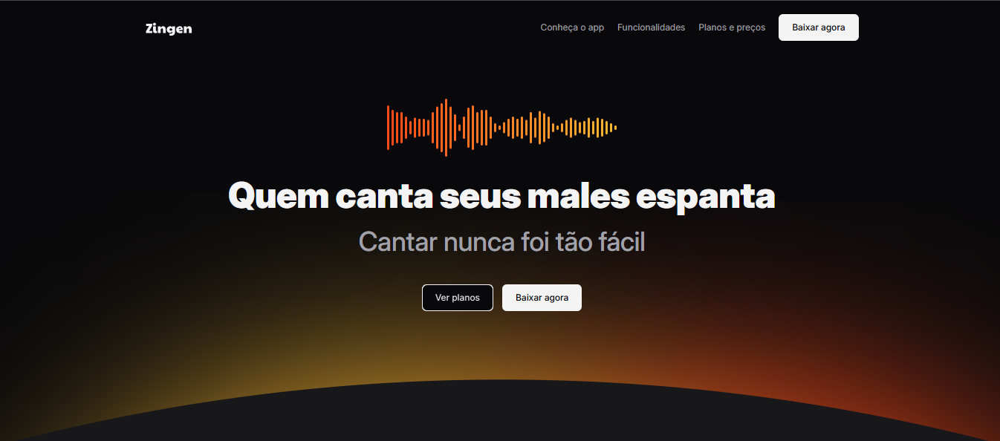

# 📱 Landing Page do App - Rocketseat Challenge

Este projeto foi desenvolvido como parte de um desafio da formação Fullstack da Rocketseat.  
O objetivo era criar uma landing page (página de apresentação) para um aplicativo fictício, aplicando boas práticas de HTML e CSS com foco em estrutura, visual e responsividade.

## 📚 Descrição do projeto

A página contém:

- Cabeçalho com navegação
- Sessões como "Conheça o app", "Funcionalidades", "Planos e preços" e "Download"
- Imagens ilustrativas do app
- Design responsivo e moderno
- Estrutura semântica e código organizado

## 💻 Tecnologias utilizadas

- HTML5  
- CSS3  
- Flexbox e Grid  
- Responsividade com media queries  
- Ícones e tipografia customizada  

## 🌐 Acesse o projeto online

🔗 [Clique aqui para visualizar](https://kauasilvandrade.github.io/lp-produto)

## 📸 Imagem do projeto

## 📌 Status do projeto

✅ Projeto finalizado e publicado.

## ✍️ Autor

**Kauã da Silva Andrade**  
[LinkedIn](https://www.linkedin.com/in/kauã-andrade-6440a9225)  
[GitHub](https://github.com/kauasilvandrade)